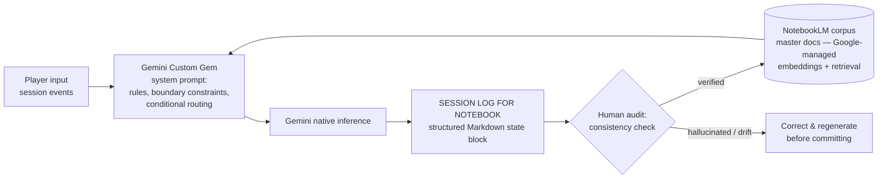

# LLM State-Tracking Lab

*Testing whether a prompt-engineered LLM can maintain coherent, structured state across long-context sessions — backed by a retrieval corpus and human-in-the-loop validation.*

## What this is

A test environment built with **Google Gemini Advanced (custom Gem)** and **Google NotebookLM**. A grimdark Lovecraftian mecha tabletop RPG ("Cursed Resonance") serves as the stress-test scenario: numeric stats, inventory/resource state, and background event clocks that must stay consistent across long sessions without hallucinating.

## What this is not

- **Not a custom model or fine-tune** — the LLM is Gemini, used as-is.
- **Not a self-built RAG pipeline** — NotebookLM provides embeddings, chunking, and retrieval natively. I designed the documentation corpus and the retrieval strategy (what gets uploaded, how it's structured, how the prompt anchors to it), not the retrieval engine.
- **Not fully automated** — every state update passes through a human audit gate before being committed to the source of truth.

## Architecture

**The loop:** the Gem runs the session, emitting a mandatory structured state block at the end of every session or combat. I audit each block against the prior log and the world bible, correct any drift, and commit the verified log to the NotebookLM corpus — which the Gem references in subsequent sessions.

## Components

1. **System prompt (Gemini Gem)** — role definition, dice-resolution mechanics, enemy/combat tactics, binding vows, faction-clock advancement rules, and a mandatory session-log output contract. Full text: `system-prompt.md`
2. **Retrieval corpus (NotebookLM)** — world bible and combat mechanics reference. Sample: `docs/world-bible-resonance.md`
3. **Output schema** — the `[SESSION LOG FOR NOTEBOOK]` Markdown block capturing pilot state, mech state, active clocks, and scene resolution. Sample: `sample-logs/session-log-01.md`
4. **HITL validation pipeline** — audit → correct → commit. Nothing enters the corpus unaudited.

## Design decisions

- **Markdown as the state format:** token-efficient, human-readable, diffable, and easy to audit by eye — no tooling required to verify a commit.
- **Forced output block at session/combat end:** guarantees a commit point. State is never allowed to persist silently in conversation memory alone.
- **Faction clocks as hidden state:** off-screen world state that must advance on triggers (failed rolls, elapsed time) — the hardest case for an LLM, since the player never sees it to catch errors.
- **Retrieval over prompt-stuffing:** long reference docs live in NotebookLM, not the system prompt, keeping the prompt lean and preserving the context window for live session state.
- **Human gate before commit:** numeric state is where LLMs hallucinate most. Unverified output never becomes source of truth.

## Failure modes this design anticipates

| Failure mode | Mitigation in this design |
|---|---|
| State drift over long contexts (stats silently change) | Structured log forces full state restatement each cycle; audit diffs against prior log |
| Hallucinated mechanics (model invents rules) | Boundary constraint: "constantly reference uploaded Knowledge files"; audit checks against world bible |
| Missed clock advancement (off-screen state stalls) | Explicit trigger rules (advance on failed roll / elapsed time) + log must list all clocks |
| Retrieval misses (model ignores corpus) | Docs organized by mechanic; key terms mirrored in the prompt as retrieval anchors |
| Compounding errors (bad state committed, then built on) | Human gate — nothing enters the corpus unaudited |

## Skills demonstrated

Prompt engineering · LLM state & schema design · retrieval-corpus design (RAG tooling) · human-in-the-loop QA · technical documentation
