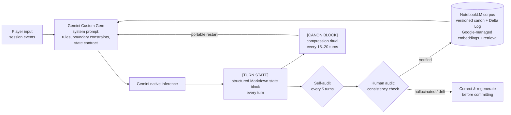

# LLM State-Tracking Lab

*Testing whether a prompt-engineered LLM can maintain coherent, structured state across long-context sessions — backed by a retrieval corpus and human-in-the-loop validation.*

## What this is

A test environment built with **Google Gemini custom Gems** and **Google NotebookLM**. Two long-running scenarios serve as stress tests: a grimdark Lovecraftian mecha RPG ("Cursed Resonance") and an original Dragon Ball saga ("Unwritten Age"). Both demand the same thing from the model: numeric stats, narrative threads, character voice consistency, and background event clocks must stay coherent across long sessions without hallucinating.

## What this is not

- **Not a custom model or fine-tune** — the LLM is Gemini, used as-is.
- **Not a self-built RAG pipeline** — NotebookLM provides embeddings, chunking, and retrieval natively. I designed the documentation corpus and the retrieval strategy (what gets uploaded, how it's structured, how the prompt anchors to it), not the retrieval engine.
- **Not fully automated** — every state update passes through a human audit gate before being committed to the source of truth.

## Architecture

**The loop:** the Gem runs the session, emitting a mandatory structured state block at the end of every turn. Every 5 turns it re-reads its own last block and flags contradictions openly (self-audit). I audit each block against the prior log and the world bible, correct any drift, and commit the verified log to the NotebookLM corpus — which the Gem references in subsequent sessions. Every 15–20 turns the Gem distills everything into a portable canon block that can restart the session in a fresh context with zero loss of load-bearing state.

## State-tracking techniques under test

1. **Per-turn state blocks** — finer granularity than session-end logs. State is restated every turn, so drift has nowhere to hide between commits.
2. **Open-loop tracking** — every unresolved narrative thread is tagged ADVANCING or PARKED in the state block. Threads can't be silently dropped; the audit checks the list.
3. **World clocks** — background/off-screen state (faction plans, rival timelines) that advances on triggers *and* between sessions, whether the player is involved or not. The hardest case for an LLM: state the player never sees to catch errors in.
4. **Self-audit turns** — every 5 turns, the model re-reads its own last state block and diffs it against what actually happened. Contradictions get an open `AUDIT FLAG` and a fix, never a silent overwrite. This sits *under* the human gate, not instead of it.
5. **Canon compression ritual** — every 15–20 turns, the full state is distilled into a self-contained `[CANON BLOCK]` (premise, entity states, threads + status, clocks, character voice tags, scene). It can be pasted into a new chat to beat context rot — the long-context countermeasure.
6. **NPC voice tags** — one line per character in every state block: how they talk + what they want. Character consistency treated as state, not vibes.
7. **Versioned canon + Delta Log** — world-changing decisions are recorded as numbered deltas against a canon version (currently v2.0 for the mecha scenario). Spinoff/sequel scenarios declare a canon anchor and inherit all deltas up to it — branching storylines without cross-contamination. The corpus is append-only history, never rewritten, so the model can't silently retcon.

## Components

1. **System prompts (Gemini Gems)** — role definition, mechanics rulesets, boundary constraints, and the full state contract (turn blocks, clocks, audits, compression, voice tags). Documented: [`system-prompt.md`](system-prompt.md). A second Gem runs the Dragon Ball scenario on the same apparatus, proving the contract is genre-independent.
2. **Retrieval corpus (NotebookLM)** — world bibles, series bible (canon v2.0), enemy bestiary, and the Delta Log. Sample: [`docs/world-bible-resonance.md`](docs/world-bible-resonance.md)
3. **Output schemas** — `[TURN STATE]` per turn, `[SESSION LOG FOR NOTEBOOK]` per session/combat. Samples: [`sample-logs/`](sample-logs/)
4. **HITL validation pipeline** — self-audit → human audit → correct → commit. Nothing enters the corpus unaudited.

## Design decisions

- **Markdown as the state format:** token-efficient, human-readable, diffable, and easy to audit by eye — no tooling required to verify a commit.
- **Forced output block every turn:** guarantees a commit point. State is never allowed to persist silently in conversation memory alone.
- **Faction clocks as hidden state:** off-screen world state that must advance on triggers (failed rolls, elapsed time) *and* between sessions — the hardest case for an LLM, since the player never sees it to catch errors.
- **Retrieval over prompt-stuffing:** long reference docs live in NotebookLM, not the system prompt, keeping the prompt lean and preserving the context window for live session state.
- **Human gate before commit:** numeric state is where LLMs hallucinate most. Unverified output never becomes source of truth.
- **Append-only canon:** the corpus records history (deltas), never rewrites it. Versioning makes retcons structurally impossible rather than merely forbidden.

## Failure modes this design anticipates

| Failure mode | Mitigation in this design |
|---|---|
| State drift over long contexts (stats silently change) | Structured block forces full state restatement every turn; self-audit diffs every 5 turns; human audit diffs against prior log |
| Context rot in very long sessions | Compression ritual: portable canon block restarts the session in fresh context with zero loss of load-bearing state |
| Silent self-contradiction | Audit turns: model re-reads its own last block, open `AUDIT FLAG`s, never silent overwrites |
| Hallucinated mechanics (model invents rules) | Boundary constraint: "constantly reference uploaded Knowledge files"; audits check against world bible |
| Missed clock advancement (off-screen state stalls) | Explicit trigger rules + between-session ticks; every block must list all clocks |
| Character voice drift | NPC voice tags (speech + want) in every state block, checked at audit |
| Dropped plot threads | Open-loop list with ADVANCING/PARKED tags; audit verifies every thread is accounted for |
| Cross-scenario contamination (two scenarios, one apparatus) | Canon versions are namespaced per saga; each story carries its version in every block |
| Retrieval misses (model ignores corpus) | Docs organized by mechanic; key terms mirrored in the prompt as retrieval anchors |
| Compounding errors (bad state committed, then built on) | Human gate — nothing enters the corpus unaudited; deltas make history inspectable |

## Skills demonstrated

Prompt engineering · LLM state & schema design · long-context evaluation · retrieval-corpus design (RAG tooling) · human-in-the-loop QA · technical documentation
